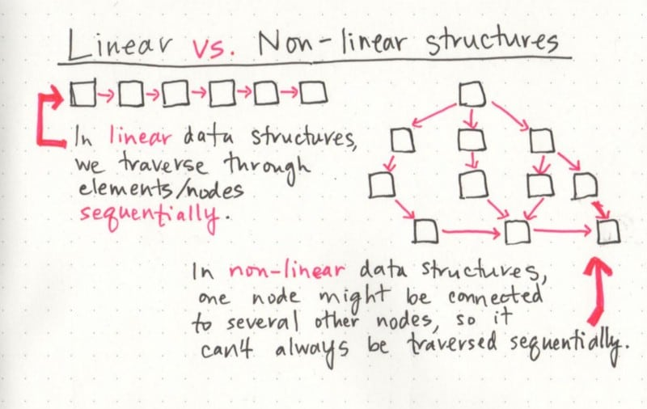
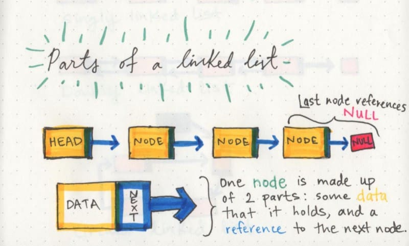
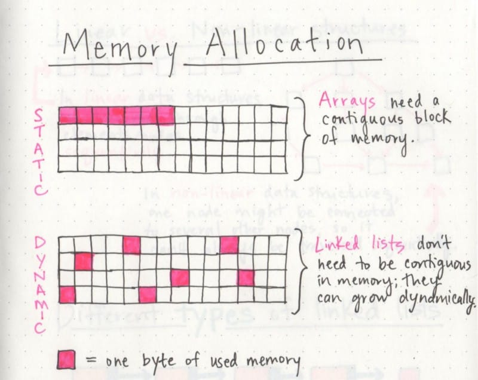
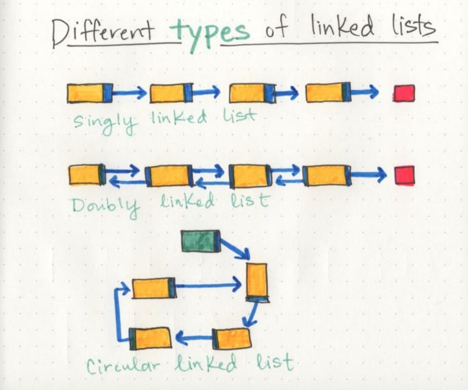

## Introduction

Linked lists function very similarly to arrays. The benefits of a linked list (over an array), is that elements can easily be inserted and removed without reallocation of any other elements (as compared to an array). Generally, since Javascript arrays are not limited to a certain size, linked lists are not really necessary.

## Resources

1. [The Odin Project](https://www.theodinproject.com/lessons/javascript-linked-lists)
2. [What's A Linked List](https://dev.to/vaidehijoshi/whats-a-linked-list-anyway)

## Structure of a Linked List

A linked list is a linear collection of data elements called nodes. The nodes point to the next node with a pointer. Each node holds a single element of data and a link (pointer) to the next node in the list. A head is the first node in the list. A tail node is the last node.

    [ NODE(head) ] -> [ NODE ] -> [ NODE(tail) ] -> null

## Memory Management

The biggest difference between a linked list and array is the way memory is used. With arrays, memory would need to be in one, contiguous block. Linked lists, however, does not need all the memory locations to be in one place. 

Also remember that arrays are static data structures (it needs all of its resources to be allocated when the structure is created) while linked lists are dynamic data structures (they can shrink and grow in memory).

## Linked-list Shapes

- Singly linked-lists - the simplest type of linked list, they go in just one direction.
- Doubly linked-list - individual nodes also have a reference pointer to its preceding node. They contain two reference pointers.
- Circular linked-list - this list does not end with a node pointing to a null value. Instead, it has a node that acts as the tail of the list, and the node after the tail node is the beginning of the list.

